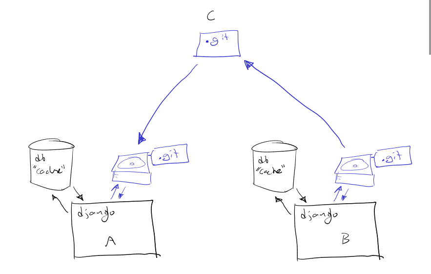

Design
======

We want a two-way sync between two data representations:
  - YAML files stored in the filesystem kept under version control
  - Database tables of a django website

The goal is leverage the power of git version control to help with decentralized
data management of hierarchical, linked data like educational content.

DB-to-YAML sync
---------------
  - Commit current filesystem contents (pre-export)
  - Serialize all DB contents and write out as YAML data files
  - Git commit (post-export) save commit hash to `yamldb_exports` DB table

YAML-to-DB sync
---------------
  - Perform DB-to-YAML sync to save DB contents
  - Parse YAML data files and create_or_update DB contents (completely overwriting existing data)
  - Git commit and add commit hash to `yamldb_imports` DB table

Intended use case
-----------------
Instead of creating accounts, managing permissions, and collaborating on a shared
database-backed application, authors can collaborate in a distributed fashion
using the well-established github pull request model.

Each author runs their own instance of the application, backed by their personal
fork of the data repository. To make things concrete, let's assume the content
consists of a hierarchy of topics (folders) and articles (files).

A YAML export consists of a YAML file to represent the topic hierarchy and an
associated `storage` directory that stores files, organized as a content-addressable filesystem
(e.g. storage/9249a531aef1 contains the contents of the image whose hash is 9249a531aef1).

For example consider the following simple data directory:

    .
    └── data
        ├── database.yml
        └── storage
            ├── 2b859112971e13ae805e04ff95b9d4f3    # == md5(article_.md)
            └── a1baa2e831670a4c0e05c6831ba3aa5e    # == md5(kolibri.png)

Where `database.yml` contains

    - Some topic (topic:/math):
    - Another topic (topic:/physics):
      - description: Physics is the study of laws of the natural world.
      - A first subtopic (topic:/physics/momentum):
      - A second subtopic (topic:/physics/energy):
        - An article about energy (file:2b859112971e13a)

and "An article about energy" document's source is

    The article title
    =================
    This is some document that uses a reference to another resource.
    
    This is the end of the article. I know... very short.

(see `../examples/simple/` for realization)

The above example shows only one possible serialization, which aims to be human-readable.
The following conventions are used in the above YAML notation:
  - If an identifier ends with a string of the form `({{model_name}}:{{primary_key}})`
    then we know this node corresponds to `ModelName.objects.find(id=primary_key)`.
  - If no "model suffix" exists for a string, we interpret the field as a property
    of the containing object.

These annotations will allow us to correctly recognize the following set of changes to the data:
  - A node is renamed (rename a topic or article by changing the string before the `(model:id)` stuff)
  - A node move
  - A node delete
  - A node content edit (change from `(file:2b859112971e13a)` to `(file:51523543141)`.

Each of these change types can faithfully be represented as a diff, wrapped in a
pull request. Out of the box, the basic git diff tools will be able to show a useful
representation, but an additional CI service could also parse the diff and show
"better than default" visualization of the changes like:
  - Move detection: instead of seeing a big patch of red and a big patch of green, you see a "move".
  - Human-readable content changes: instead of line diffs for content nodes, you show the output of `git diff --color-words`

The usual github PR process can take place, with "code review" and other process.
Once the PR is accepted and merged into master (ideally a fast-forward merge),
then the "official source of truth" has changed so "technically" the contents of
every database out there are "outdated". Take the time to think about this, because
it's not very intuitive—we always seem to associated the DB as the ultimate source
of truth about facts.

Basically, we define the source of truth for the data as the contents of the master
branch in `github.com/org/project_name__data.git`.
Every user can update from master by pulling from the central repo.
If the user maintains any "customization branches" on top of the master branch
they can rebase their customizations on top of the new master.

Testing strategy
----------------
To test the full roundtrip from DB to files and back to DB:
 - dump the graph tables of the DB to an before.sql file
 - run export to YAML
 - drop the tables
 - import the data from YAML
 - dump tables again to obtain after.sql
The files before.sql and after.sql should be identical (up to auto-assigned keys)

